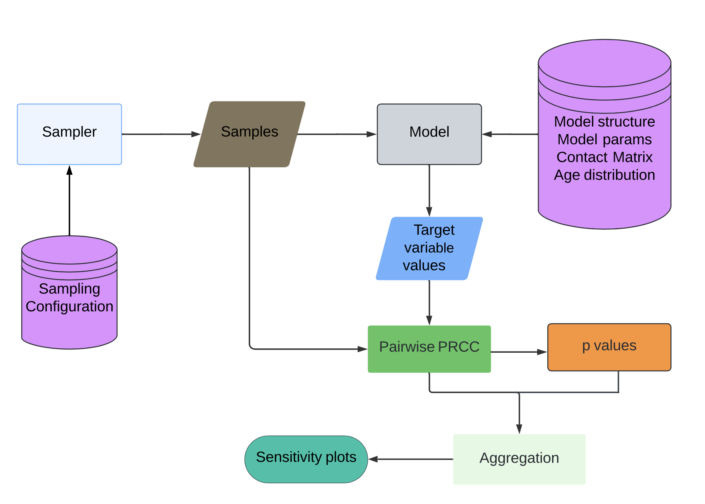

# Sensitivity analysis of contact-related interventions for modeling epidemics.

## Introduction
This repository conducts sensitivity analysis on various COVID-19 models, 
exploring their behavior under different contact matrix element variations.

## Key Investigation
- **Contact Matrix Analysis**: Evaluating how perturbations in the contact matrix affect various targets.

## Data Files
├── data  # Contains all files organized by model name and type.
│   ├── age_distribution  # Details the age group population used in the models.
│   ├── contact_matrices # Contains contact matrices for different settings:
│   │   ├── For **Chikina**, **Moghadas**, and **Rost** models: Home, School, Work, Other.
│   │   └── For **Seir** model: All, Physical.
│   └── model_parameters  # JSON files containing parameters specific to each model.


## Targets Investigated
- **R0 (Basic Reproduction Number)**
  - **Description**: Represents the average number of secondary infections caused by one infected individual in a completely susceptible population.
  
- **Epidemic Size**
  - **Description**: The total number of individuals who become infected during the entire course of the epidemic.
  
- **ICU Peak Size**
  - **Description**: The maximum number of ICU beds occupied at the peak of the epidemic.
  
- **Hospital Peak Size**
  - **Description**: The highest number of hospital beds occupied at the peak of the epidemic.
  
- **Final Death Size**
  - **Description**: The total number of deaths attributed to the epidemic by its conclusion.
  
## Method
A summary about the steps of the research project:


## Folder Structure
├── data                
├── src                    
│   ├── examples        
│   │   ├── chikina     
│   │   ├── moghadas    
│   │   ├── rost       
│   │   ├── seir        
│   ├── model           
│   │   ├── model_base          
│   │   ├── r0_generator_base   
│   ├── prcc          
│   │   ├── prcc       
│   │   ├── prcc_calculator  
│   ├── sampling        
│   │   ├── target      
│   │   ├── cm_calculator_lockdown  
│   │   ├── sampler_base  
│   │   ├── sampler_npi  
│   ├── simulation      
│   │   ├── contact_manipulation 
│   │   ├── simulation_base       
│   │   ├── simulation_npi      
│   ├── dataloader     
│   └── plotter       
└── main               


## File Details

#### `src/examples/chikina`
- **`model.py`**: Implements the Chikina model.
- **`r0.py`**: Calculates R0 values using the Next Generation Matrix (NGM).

#### `src/examples/moghadas`
- **`model.py`**: Implements the Moghadas model.
- **`r0.py`**: Calculates R0 values using the Next Generation Matrix (NGM).

#### `src/examples/rost`
- **`model.py`**: Implements the Rost model.
- **`r0.py`**: Calculates R0 values using the Next Generation Matrix (NGM).

#### `src/examples/seir`
- **`model.py`**: Implements the SEIR model.
- **`r0.py`**: Calculates R0 values using the Next Generation Matrix (NGM).

#### `src/model`
- **`model_base.py`**: Contains the base class for epidemic models.
- **`r0_generator_base.py`**: Provides a foundational framework for R0 calculations in epidemic models.

#### `src/prcc`
- **`prcc.py`**: Converts vectors of matrix values into full symmetric matrices and calculates PRCC values.
- **`prcc_calculator.py`**: Calculates PRCC values and their corresponding p-values, and aggregates PRCC values by age group.

#### `src/sampling/target`
- **`cm_calculator_lockdown.py`**: Calculates simulation outputs for lockdown scenarios.
- **`sampler_base.py`**: Conducts parameter sampling using Latin Hypercube Sampling (LHS), generates samples, and saves outputs.
- **`sampler_npi.py`**: Implements `SamplerBase`, controls samples using kappa, and obtains samples for different targets.

#### `src/simulation`
- **`contact_manipulation.py`**: Analyzes the impact of age group contact percentage manipulation on targets for different models.
- **`simulation_base.py`**: Base class for `simulation_npi`, sets up data from the data loader.
- **`simulation_npi.py`**: Inherits from `SimulationBase`, handles simulations, parameter updates, sensitivity analysis, and result plotting.

#### `src`
- **`dataloader.py`**: Loads and organizes data based on country and model.
- **`plotter.py`**: Generates plots based on analysis results.
- **`main.py`**: Executes the code to run simulations and generate results.

## Implementation
To run the simulation, follow these steps:
1. Open `main.py` and configure the simulation parameters.
2. Use the following code templates for different scenarios. Adjust the country and epi_model as needed.

#### Example: United States with the Moghadas Model
data = DataLoader(country="united_states")
simulation = src.SimulationNPI(data=data, n_samples=10000, epi_model="moghadas", country="united_states")

#### Example: Hungary with the Rost Model
data = DataLoader(country="Hungary")
simulation = src.SimulationNPI(data=data, n_samples=10000, epi_model="rost", country="Hungary")

#### Example: United Kingdom (UK) with the SEIR Model
data = DataLoader(country="UK")
simulation = src.SimulationNPI(data=data, n_samples=10000, epi_model="seir", country="UK")

#### Example: United States with the Chikina Model
data = DataLoader(country="usa")
simulation = src.SimulationNPI(data=data, n_samples=10000, epi_model="chikina", country="usa")

3. Run the simulation with these steps:
  ##### Generate Latin Hypercube Sampling (LHS)
  simulation.generate_lhs()
  #### Calculate Partial Rank Correlation Coefficient (PRCC) values
  simulation.calculate_prcc_values()
  #### Plot the PRCC values
  simulation.plot_prcc_values()
  #### Generate analysis results based on the simulation
  simulation.generate_analysis_results()
  #### Plot the maximum values for contact manipulation
  simulation.plot_max_values_contact_manipulation()


## Requirement
This project is developed and tested with Python 3.8 or higher. Install dependencies from `requirements.txt`:
```bash
pip install -r requirements.txt
